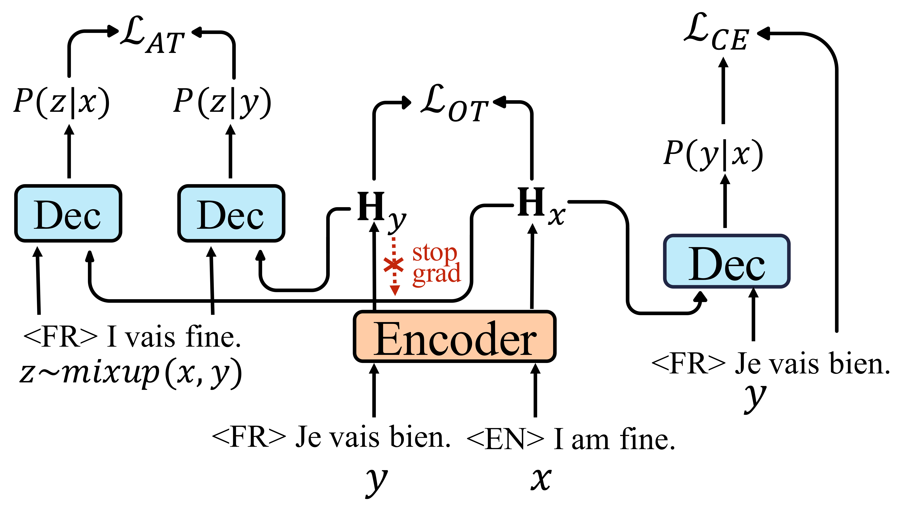

# Zero-MNMT 
Source code for the EMNLP 2022 Long findings ["Improving Zero-Shot Multilingual Translation with Universal Representations and Cross-Mappings"](https://arxiv.org/abs/2210.15851).

We propose two training objectives to improve the zero-shot ability of many-to-many multilingual neural machine translation. 

The OT loss is used to bridge the gap between the semantic spaces of different languages, and the AT loss is used to improve the prediction consistency of the MNMT model based on different source languages.  



## Code  

This code is based on the open source toolkit [fairseq-py](https://github.com/facebookresearch/fairseq).

All the core codes of our method are put in the folder "./zs_nmt".

Codes related to the training objectives are in _label_smoothed_cross_entropy_adapter_zs.py_

_translation_w_langtok.py_ is taken from [mRASP2](https://github.com/PANXiao1994/mRASP2) directly for generation.

## Get Started 

This system has been tested in the following environment.
+ Python version \== 3.7
+ Pytorch version \== 1.7

### Build 
```
pip install --editable ./
```

### Data 
+ IWSLT: https://wit3.fbk.eu/2017-01
+ PC-6: https://github.com/PANXiao1994/mRASP2
+ OPUS-7: https://opus.nlpl.eu/opus-100.php

The dataset should be tokenized and performed with BPE first. 
Following mRASP2, we also append special language tokens "LANG_TOK_XX" at the beginning of both the source and target sentences to indicate the language. Then we mix the multilingual data and train the model with the mixed data. 

### Training
Taking IWSLT as an example. First, pre-train the model only with the cross-entropy loss
```
# path to data_bin
data=
# save dir for the checkpoints
dir=

CUDA_VISIBLE_DEVICES=0,1,2,3  python fairseq_cli/train.py --ddp-backend=no_c10d  $data \
	  --arch transformer_wmt_en_de  --share-all-embeddings  --fp16 --reset-dataloader \
	    --optimizer adam --adam-betas '(0.9, 0.98)' --clip-norm 0.0 \
        --user-dir zs_nmt  --pre-train \
        --gamma1 0. --gamma2 0. --language-tag-id '3,14,15,18,21' \
	      --lr-scheduler inverse_sqrt --warmup-init-lr 1e-07 --warmup-updates 4000 \
	        --lr 0.0007 --stop-min-lr 1e-09 --dropout 0.3 --seed 9527 \
           --criterion label_smoothed_cross_entropy_zs --label-smoothing 0.1 --weight-decay 0.0\
		    --max-tokens 4096   --save-dir checkpoints/$dir --max-update 20000\
		    --update-freq 2 --no-progress-bar --log-format json --log-interval 25  --save-interval-updates  2000 --keep-interval-updates 40
 ```
+ *--dropout* is set as 0.3 for for IWSLT datasets and 0.1 for PC-6 and OPUS-7 datasets.
+ *--max-update* is set as 20k for IWSLT and 100K for PC-6 and OPUS-7.
+ *--language-tag-id* is the dictionary id (started by 1) of the special language tokens "LANG_TOK_XX". So this should be set dynamically according to the dictionary used for training.

Then fine-tuning the pretrained model:
```
# path to data_bin
data=
# save dir for the checkpoints
dir=
# the pre-trained checkpoint
ckt=

CUDA_VISIBLE_DEVICES=0,1,2,3  python fairseq_cli/train.py --ddp-backend=no_c10d  $data \
	  --arch transformer_wmt_en_de  --share-all-embeddings  --fp16 --reset-dataloader \
	    --optimizer adam --adam-betas '(0.9, 0.98)' --clip-norm 0.0 \
        --user-dir zs_nmt   --restore-file $ckt \
        --gamma1 0.4 --gamma2 0.002 --language-tag-id '3,14,15,18,21' \
	      --lr-scheduler inverse_sqrt --warmup-init-lr 1e-07 --warmup-updates 4000 \
	        --lr 0.0007 --stop-min-lr 1e-09 --dropout 0.3 --seed 9527 \
           --criterion label_smoothed_cross_entropy_zs --label-smoothing 0.1 --weight-decay 0.0\
		    --max-tokens 4096   --save-dir checkpoints/$dir --max-update 100000\
		    --update-freq 2 --no-progress-bar --log-format json --log-interval 25  --save-interval-updates  2000 --keep-interval-updates 40
 ```
+ *--max-update* is set as 100k for IWSLT and 300K for PC-6 and OPUS-7.
+ *--gamma1* and *--gamma2* are the hyperparameters of our method. 

|dataset| gamma1 | gamma2 |
|:----: | :----: | :----:|
|IWSLT| 0.4 | 0.001 |
|IWSLT-b | 0.2 | 0.002 |
|PC-6 | 0.2 | 0.003|
|OPUS-7 | 0.3 | 0.01|

### Inference 
Generate translation and compute BLEU with SacreBLEU tool \== 1.5.1 .
```
#!/bin/bash
# root path of the moses toolkit.
mosesdecoder=
# path to the references
dir=
deit_de=$dir/de-it.de
denl_de=$dir/de-nl.de
dero_de=$dir/de-ro.de
itde_it=$dir/it-de.it
itnl_it=$dir/it-nl.it
itro_it=$dir/it-ro.it
nlde_nl=$dir/nl-de.nl
nlit_nl=$dir/nl-it.nl
nlro_nl=$dir/nl-ro.nl
rode_ro=$dir/ro-de.ro
roit_ro=$dir/ro-it.ro
ronl_ro=$dir/ro-nl.ro

mkdir -p BLEU

gen_sen(){
    CUDA_VISIBLE_DEVICES=$1 python fairseq_cli/generate.py data-bin/$2 --path $3 --gen-subset $4 --user-dir zs_nmt --lang-prefix-tok LANG_TOK_$6 --beam 5 --batch-size 500 --remove-bpe  --lenpen 0.6 --task translation_w_langtok  --fp16 | tee tmp/$5/gen.out.$(basename $3).$4
    python choose-translation.py tmp/$5/gen.out.$(basename $3).$4 tmp/$5/$4.$(basename $3)
    sed -e 's/.\{12\}//' < tmp/$5/$4.$(basename $3) > tmp/$5/$4.$(basename $3).notag
    perl $mosesdecoder/scripts/tokenizer/detokenizer.perl -l `echo $6 | tr 'A-Z' 'a-z'` < tmp/$5/$4.$(basename $3).notag > tmp/$5/$4.$(basename $3).detok
}
#$1: GPU
#$2: $data
#$3: $file
#$4: $subset
#$5: $model
#$6: language token
#$7: time
#$8: lang pair
# databin for generation
data=
# dir for checkpoints
model=
mkdir -p tmp/$model
out_file=BLEU/$model
for file in ./checkpoints/$model/*
do
    echo $file >> $out_file
    gen_sen 0 $data $file test $model IT  &
    gen_sen 1 $data $file test1 $model NL  &
    gen_sen 2 $data $file test2 $model RO  &
    gen_sen 3 $data $file test3 $model DE  &
    wait
    gen_sen 0 $data $file test4 $model NL  &
    gen_sen 1 $data $file test5 $model RO  &
    gen_sen 2 $data $file test6 $model DE  &
    gen_sen 3 $data $file test7 $model IT  &
    wait
    gen_sen 0 $data $file test8 $model RO  &
    gen_sen 1 $data $file test9 $model DE  &
    gen_sen 2 $data $file test10 $model IT  &
    gen_sen 3 $data $file test11 $model NL  &
    wait
    declare -a bleu
    sum=0.0
    bleu[0]=`cat tmp/$model/test.$(basename $file).detok | sacrebleu $itde_it -w 2`
    bleu[1]=`cat tmp/$model/test1.$(basename $file).detok | sacrebleu $nlde_nl -w 2`
    bleu[2]=`cat tmp/$model/test2.$(basename $file).detok | sacrebleu $rode_ro -w 2`
    bleu[3]=`cat tmp/$model/test3.$(basename $file).detok | sacrebleu $deit_de -w 2`
    bleu[4]=`cat tmp/$model/test4.$(basename $file).detok | sacrebleu $nlit_nl -w 2`
    bleu[5]=`cat tmp/$model/test5.$(basename $file).detok | sacrebleu $roit_ro -w 2`
    bleu[6]=`cat tmp/$model/test6.$(basename $file).detok | sacrebleu $denl_de -w 2`
    bleu[7]=`cat tmp/$model/test7.$(basename $file).detok | sacrebleu $itnl_it -w 2`
    bleu[8]=`cat tmp/$model/test8.$(basename $file).detok | sacrebleu $ronl_ro -w 2`
    bleu[9]=`cat tmp/$model/test9.$(basename $file).detok | sacrebleu $dero_de -w 2`
    bleu[10]=`cat tmp/$model/test10.$(basename $file).detok | sacrebleu $itro_it -w 2`
    bleu[11]=`cat tmp/$model/test11.$(basename $file).detok | sacrebleu $nlro_nl -w 2`
    declare -a b
    for ((i=0;i<${#bleu[*]};i++))
    do
        echo "${bleu[$i]}" >> $out_file
        b[$i]=`echo ${bleu[$i]}|sed "s/.*1.5.1\ =\ \([0-9.]\{1,\}\).*/\1/"`
        sum=`echo "scale=2;$sum+${b[$i]}"|bc`
    done
    avg=`echo "scale=2;$sum/${#b[*]}"|bc`
    echo  "AVG  $avg" >> $out_file
done
```

## Citation
```
@inproceedings{GuF22,
  author    = {Shuhao Gu and
               Yang Feng },
  title     = {Improving Zero-Shot Multilingual Translation with Universal Representations and Cross-Mappings},
  booktitle = {Proceedings of the EMNLP 2022 Long Findings},
  year      = {2022},
  url       = {https://arxiv.org/abs/2210.15851},
}
```
